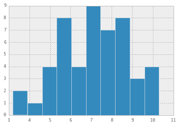
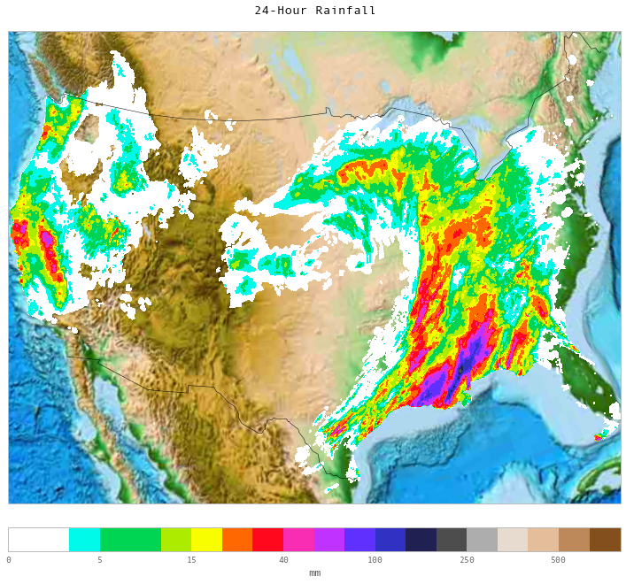

# Mapping Location Data and Chloropleths from Python

We'll begin with the [Folium](https://folium.readthedocs.org) library as it
brings together a number of current geotools together with the Pandas data
wrangling paradigm we're familiar with.

The tools employed include:
* The [leaflet](http://leafletjs.com/) javascript library for interactive maps
* Tilesets from [OpenStreetMap](openstreetmap.org),
[Mapbox](https://www.mapbox.com/), [Stamen](stamen.com) and more.
* Color schemes from [color-brewer](colorbrewer2.org)
* Incorporation of D3 diagrams through
[Vincent](http://vincent.readthedocs.org/en/latest/)

Each of these tools should be reviewed in their own right, and many, as well as
additional resources, are listed in the table in the README.md with additional
details.

We'll also be introducing [Basemap](http://matplotlib.org/basemap/) which is
matplotlib's feature-rich geomapping toolkit, but which lacks the web-friendly
and interactive features, as well as the user-friendliness, of the Folium
collection.

## Outline:
1. Where are we?  Finding a point on a map.
2. Visualizing US and World Data
3. Heatmaps with BaseMap

## 1. Where are we?

    # If not yet installed: "pip install dstk"; "pip install folium"
    import folium

    # Get Lat/Long from an address

#### Use [GeoPy](https://github.com/geopy/geopy) to locate coordinates for an address

    # 'pip install geopy' if needed
    import geopy

    

    # Make a folium map with a circle
    from geopy.geocoders import GoogleV3
    geolocator = GoogleV3()
    from IPython.display import HTML

    # Set address
    addy="10 E 21 St,New York, NY"
    address, (latitude,longitude) = geolocator.geocode(addy)
    print(address, latitude, longitude)

    (u'10 East 21st Street, New York, NY 10010, USA', 40.7400191, -73.9900873)

    

    

#### Make a map
_Note, code is exposed, rather than placed in appropriate DRY classes and
fucntions, to provide clarity for demonstration purposes_

Core concepts:
* [tiles](http://wiki.openstreetmap.org/wiki/Tiles)

    

    folium.Map?

    # Establish a map centered at lat/long, set "tiles" and zoom levels
    map_ourmap = folium.Map(location=[latitude,longitude],zoom_start=13,tiles="Stamen Toner")
    
    # Create circle marker around it.  Try map_ourmap? for additional functions in the "Map" class
    map_ourmap.circle_marker(location=[latitude,longitude],radius=200,fill_opacity=0.5,fill_color='#3186cc')
    
    # Make the map!
    map_ourmap.create_map(path='ourmap.html')
    
    # Display the map inline
    HTML('<iframe src=ourmap.html width=800 height = 500><iframe>')

<iframe src=ourmap.html width=800 height = 500><iframe>

    

## 2. Visualizing US and World Data -- Introduction to Chloropleths

#### Example: State Unemployment Data
Features: US States

Choropleth = Chloro (Area/Region) + Pleth (quantity)

    # Get state shapes and state data
    state_geo = r'data/us-states.json'
    state_unemployment = r'data/US_Unemployment_Oct2012.csv'
    import pandas as pd
    state_data = pd.read_csv(state_unemployment)

    state_data.Unemployment.hist()

    <matplotlib.axes.AxesSubplot at 0x1068b2c90>

    

    # Make a map
    map = folium.Map(location=[48, -102], zoom_start=3)
    map.geo_json(geo_path=state_geo, data=state_data,
                 columns=['State', 'Unemployment'],
                 key_on='feature.id',
                 fill_color='RdPu', fill_opacity=0.65, line_opacity=0.5,
                 legend_name='Unemployment Rate (%)')
    map.create_map(path='us_states.html')

    # Display the map inline
    HTML('<iframe src=us_states.html width=1000 height = 500><iframe>')

<iframe src=us_states.html width=1000 height = 500><iframe>

#### Example: Inequality Adjusted Human Development Index
Features: Countries of the World

    # Get shapes and data
    world_geo = r'data/countries.geo.json'
    ihdi_data = r'data/ihdi.csv'
    import pandas as pd
    import numpy as np
    import matplotlib.pyplot as plt

    ihdi_data = pd.read_csv(ihdi_data)

    #Initialize a data frame
    df = pd.DataFrame()

    # Include two columns of interest:
    df[['Country','Loss']] = ihdi_data[['Country Code','2012 IHDI Overall Loss(%)']]

    # Set index to Country Code
    df.index = df['Country']

    # Remove rows where country is null
    df = df[pd.notnull(df['Country'])]

    # Convert string to float
    df.Loss = df.Loss.str.replace('%','')
    df.Loss = df.Loss.replace('..','NaN')
    df.Loss=df.Loss.astype('float64')

    df

<table border="1" class="dataframe">
  <thead>
    <tr style="text-align: right;">
      <th></th>
      <th>Country</th>
      <th>Loss</th>
    </tr>
    <tr>
      <th>Country</th>
      <th></th>
      <th></th>
    </tr>
  </thead>
  <tbody>
    <tr>
      <th>NOR</th>
      <td> NOR</td>
      <td>  6.4</td>
    </tr>
    <tr>
      <th>AUS</th>
      <td> AUS</td>
      <td>  7.9</td>
    </tr>
    <tr>
      <th>USA</th>
      <td> USA</td>
      <td> 12.4</td>
    </tr>
    <tr>
      <th>NLD</th>
      <td> NLD</td>
      <td>  6.9</td>
    </tr>
    <tr>
      <th>DEU</th>
      <td> DEU</td>
      <td>  6.9</td>
    </tr>
    <tr>
      <th>NZL</th>
      <td> NZL</td>
      <td>  NaN</td>
    </tr>
    <tr>
      <th>IRL</th>
      <td> IRL</td>
      <td>  7.2</td>
    </tr>
    <tr>
      <th>SWE</th>
      <td> SWE</td>
      <td>  6.2</td>
    </tr>
    <tr>
      <th>CHE</th>
      <td> CHE</td>
      <td>  7.0</td>
    </tr>
    <tr>
      <th>JPN</th>
      <td> JPN</td>
      <td>  NaN</td>
    </tr>
    <tr>
      <th>CAN</th>
      <td> CAN</td>
      <td>  8.7</td>
    </tr>
    <tr>
      <th>KOR</th>
      <td> KOR</td>
      <td> 16.5</td>
    </tr>
    <tr>
      <th>HKG</th>
      <td> HKG</td>
      <td>  NaN</td>
    </tr>
    <tr>
      <th>ISL</th>
      <td> ISL</td>
      <td>  6.4</td>
    </tr>
    <tr>
      <th>DNK</th>
      <td> DNK</td>
      <td>  6.2</td>
    </tr>
    <tr>
      <th>ISR</th>
      <td> ISR</td>
      <td> 12.3</td>
    </tr>
    <tr>
      <th>BEL</th>
      <td> BEL</td>
      <td>  8.0</td>
    </tr>
    <tr>
      <th>AUT</th>
      <td> AUT</td>
      <td>  6.6</td>
    </tr>
    <tr>
      <th>SGP</th>
      <td> SGP</td>
      <td>  NaN</td>
    </tr>
    <tr>
      <th>FRA</th>
      <td> FRA</td>
      <td>  9.0</td>
    </tr>
    <tr>
      <th>FIN</th>
      <td> FIN</td>
      <td>  6.0</td>
    </tr>
    <tr>
      <th>SVN</th>
      <td> SVN</td>
      <td>  5.8</td>
    </tr>
    <tr>
      <th>ESP</th>
      <td> ESP</td>
      <td> 10.1</td>
    </tr>
    <tr>
      <th>LIE</th>
      <td> LIE</td>
      <td>  NaN</td>
    </tr>
    <tr>
      <th>ITA</th>
      <td> ITA</td>
      <td> 11.9</td>
    </tr>
    <tr>
      <th>LUX</th>
      <td> LUX</td>
      <td>  7.2</td>
    </tr>
    <tr>
      <th>GBR</th>
      <td> GBR</td>
      <td>  8.3</td>
    </tr>
    <tr>
      <th>CZE</th>
      <td> CZE</td>
      <td>  5.4</td>
    </tr>
    <tr>
      <th>GRC</th>
      <td> GRC</td>
      <td> 11.5</td>
    </tr>
    <tr>
      <th>BRN</th>
      <td> BRN</td>
      <td>  NaN</td>
    </tr>
    <tr>
      <th>...</th>
      <td>...</td>
      <td>...</td>
    </tr>
    <tr>
      <th>BEN</th>
      <td> BEN</td>
      <td> 35.8</td>
    </tr>
    <tr>
      <th>RWA</th>
      <td> RWA</td>
      <td> 33.9</td>
    </tr>
    <tr>
      <th>CIV</th>
      <td> CIV</td>
      <td> 38.6</td>
    </tr>
    <tr>
      <th>COM</th>
      <td> COM</td>
      <td>  NaN</td>
    </tr>
    <tr>
      <th>MWI</th>
      <td> MWI</td>
      <td> 31.4</td>
    </tr>
    <tr>
      <th>SDN</th>
      <td> SDN</td>
      <td>  NaN</td>
    </tr>
    <tr>
      <th>ZWE</th>
      <td> ZWE</td>
      <td> 28.5</td>
    </tr>
    <tr>
      <th>ETH</th>
      <td> ETH</td>
      <td> 31.9</td>
    </tr>
    <tr>
      <th>LBR</th>
      <td> LBR</td>
      <td> 35.3</td>
    </tr>
    <tr>
      <th>AFG</th>
      <td> AFG</td>
      <td>  NaN</td>
    </tr>
    <tr>
      <th>GNB</th>
      <td> GNB</td>
      <td> 41.4</td>
    </tr>
    <tr>
      <th>SLE</th>
      <td> SLE</td>
      <td> 41.6</td>
    </tr>
    <tr>
      <th>BDI</th>
      <td> BDI</td>
      <td>  NaN</td>
    </tr>
    <tr>
      <th>GIN</th>
      <td> GIN</td>
      <td> 38.8</td>
    </tr>
    <tr>
      <th>CAF</th>
      <td> CAF</td>
      <td> 40.5</td>
    </tr>
    <tr>
      <th>ERI</th>
      <td> ERI</td>
      <td>  NaN</td>
    </tr>
    <tr>
      <th>MLI</th>
      <td> MLI</td>
      <td>  NaN</td>
    </tr>
    <tr>
      <th>BFA</th>
      <td> BFA</td>
      <td> 34.2</td>
    </tr>
    <tr>
      <th>TCD</th>
      <td> TCD</td>
      <td> 40.1</td>
    </tr>
    <tr>
      <th>MOZ</th>
      <td> MOZ</td>
      <td> 32.7</td>
    </tr>
    <tr>
      <th>COD</th>
      <td> COD</td>
      <td> 39.9</td>
    </tr>
    <tr>
      <th>NER</th>
      <td> NER</td>
      <td> 34.2</td>
    </tr>
    <tr>
      <th>PRK</th>
      <td> PRK</td>
      <td>  NaN</td>
    </tr>
    <tr>
      <th>MHL</th>
      <td> MHL</td>
      <td>  NaN</td>
    </tr>
    <tr>
      <th>MCO</th>
      <td> MCO</td>
      <td>  NaN</td>
    </tr>
    <tr>
      <th>NRU</th>
      <td> NRU</td>
      <td>  NaN</td>
    </tr>
    <tr>
      <th>SMR</th>
      <td> SMR</td>
      <td>  NaN</td>
    </tr>
    <tr>
      <th>SOM</th>
      <td> SOM</td>
      <td>  NaN</td>
    </tr>
    <tr>
      <th>SSD</th>
      <td> SSD</td>
      <td>  NaN</td>
    </tr>
    <tr>
      <th>TUV</th>
      <td> TUV</td>
      <td>  NaN</td>
    </tr>
  </tbody>
</table>

195 rows × 2 columns

    a=df['Loss'].hist()
    a.set_title('Percent Loss due to Inequality: Distribution\n')

    <matplotlib.text.Text at 0x107056650>

    

    # Make a map
    map = folium.Map(location=[48, -102], zoom_start=2)
    map.geo_json(geo_path=world_geo, data=df,
                 columns=['Country','Loss'],
                 threshold_scale=[5,10,15],
                 key_on='feature.id',
                 fill_color='YlGnBu', fill_opacity=0.65, line_opacity=0.5,
                 legend_name='Development Loss due to Inequality')
    map.create_map(path='lossmap6.html')

    
    HTML('<iframe src=lossmap6.html width=1000 height = 500><iframe>')

<iframe src=lossmap6.html width=1000 height = 500><iframe>

    

## 3. A Heatmap with Basemap

    # Import our libraries
    from mpl_toolkits.basemap import Basemap, cm
    # requires netcdf4-python (netcdf4-python.googlecode.com)
    from netCDF4 import Dataset as NetCDFFile
    import numpy as np
    import matplotlib.pyplot as plt
    import pandas as pd

Network Common Data Form (NetCDF):

NetCDF NetCDF is a set of software libraries and self-describing, machine-
independent data formats that support the creation, access, and sharing of
array-oriented scientific data.

    # plot rainfall from NWS using special precipitation
    # colormap used by the NWS, and included in basemap.
    nc = NetCDFFile('data/nws_precip_conus_20061222.nc')
    # data from http://water.weather.gov/precip/

    # Let's look at what we have here:
    nc.variables.keys()

    [u'amountofprecip',
     u'lat',
     u'lon',
     u'true_lat',
     u'true_lon',
     u'timeofdata',
     u'timeofcreation',
     u'hrap_xor',
     u'hrap_yor']

    

    # Format our data and our latlong
    prcpvar = nc.variables['amountofprecip']
    data = 0.01*prcpvar[:]
    latcorners = nc.variables['lat'][:]
    loncorners = -nc.variables['lon'][:]
    lon_0 = -nc.variables['true_lon'].getValue()
    lat_0 = nc.variables['true_lat'].getValue()

#### Make our Map

    
    # create figure and axes instances
    
    # Create our figure
    fig = plt.figure(figsize=(12,12))
    
    ax = fig.add_axes([0.1,0.1,0.8,0.8])
    
    
    # create polar stereographic Basemap instance.
    m = Basemap(projection='stere',lon_0=lon_0,lat_0=90.,lat_ts=lat_0,\
                llcrnrlat=latcorners[0],urcrnrlat=latcorners[2],\
                llcrnrlon=loncorners[0],urcrnrlon=loncorners[2],\
                rsphere=6371200.,resolution='l',area_thresh=10000)
    
    # draw coastlines, state and country boundaries, edge of map.
    #m.drawcoastlines()
    #m.drawstates()
    m.drawcountries()
    
    
    # draw parallels.
    #parallels = np.arange(0.,90,10.)
    #m.drawparallels(parallels,labels=[1,0,0,0],fontsize=10)
    
    
    # draw meridians
    #meridians = np.arange(180.,360.,10.)
    #m.drawmeridians(meridians,labels=[0,0,0,1],fontsize=10)
    
    ny = data.shape[0]; nx = data.shape[1]
    lons, lats = m.makegrid(nx, ny) # get lat/lons of ny by nx evenly space grid.
    x, y = m(lons, lats) # compute map proj coordinates.
    
    #Make it topographical
    m.etopo()
    
    # draw filled contours using the basemap countours function
    clevs = [0,1,2.5,5,7.5,10,15,20,30,40,50,70,100,150,200,250,300,400,500,600,750]
    
    cs = m.contourf(x,y,data,clevs,cmap=cm.s3pcpn)
    
    
    # add colorbar.
    cbar = m.colorbar(cs,location='bottom',pad="5%")
    cbar.set_label('mm')
    # add title
    plt.title(prcpvar.long_name+'\n')
    # Add date to title: +' for period ending '+prcpvar.dateofdata+'\n')
    plt.show()

    
